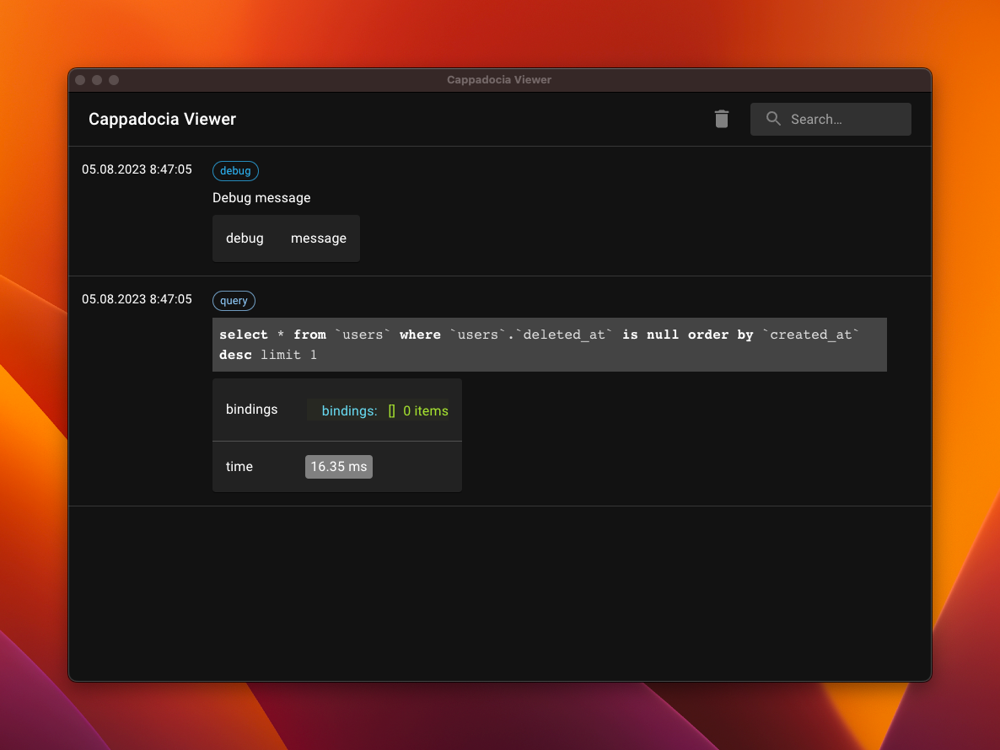

# Cappadocia Viewer for Laravel
<picture>
  
</picture>

[](https://packagist.org/packages/hsndmr/cappadocia-viewer-for-laravel)
[](https://github.com/hsndmr/cappadocia-viewer-for-laravel/actions?query=workflow%3Arun-tests+branch%3Amain)
[](https://github.com/hsndmr/cappadocia-viewer-for-laravel/actions?query=workflow%3A"Fix+PHP+code+style+issues"+branch%3Amain)
[](https://packagist.org/packages/hsndmr/cappadocia-viewer-for-laravel)


## Installation

Prior to installing this package, ensure that you have already installed  [Cappadocia Viewer](https://github.com/hsndmr/cappadocia-viewer/releases/tag/0.0.2)

You can install the package via composer:

```bash
composer require hsndmr/cappadocia-viewer-for-laravel --dev
```

You can publish the config file with:

```bash
php artisan vendor:publish --tag="cappadocia-viewer"
```

This is the contents of the published config file:

```php
return [
    'server_url'    => env('CAPPADOCIA_VIEWER_SERVER_URL', 'http://127.0.0.1:9091'),
    'timeout'       => env('CAPPADOCIA_VIEWER_TIMEOUT', 3),
    'enabled'       => env('CAPPADOCIA_VIEWER_ENABLED', true),
    'watch_logs'    => env('CAPPADOCIA_VIEWER_WATCH_LOGS', true),
    'watch_jobs'    => env('CAPPADOCIA_VIEWER_WATCH_JOBS', false),
    'watch_queries' => env('CAPPADOCIA_VIEWER_WATCH_QUERIES', false),
];
```

## Usage

### Showing Queries

You can show queries by using `cappadocia` helper function.

````php
    cappadocia()->watchQueries();
    User::latest()->first();
    cappadocia()->stopWatchingQueries();
    
    // This query will not be shown in the viewer
    User::first()->first();
````

<picture>
  
</picture>

If you want to show all queries, you can add `CAPPADOCIA_VIEWER_WATCH_QUERIES=true` to your .env file.

### Showing Jobs
You can show jobs by using `cappadocia` helper function. 

```` php
cappadocia()->watchJobs();
CappadociaViewerJob::dispatchSync('viewer');
cappadocia()->stopWatchingJobs();

// This job will not be shown in the viewer
CappadociaViewerJob::dispatchSync('another viewer');
````

<picture>
  
</picture>

If you are utilizing Laravel Horizon, you can insert `CAPPADOCIA_VIEWER_WATCH_JOBS=true` into your .env file. This will enable you to view all jobs in the viewer
```` php
CappadociaViewerJob::dispatch('viewer');
````

### Showing Logs

Logs are shown by default. If you want to disable it, you can add `CAPPADOCIA_VIEWER_WATCH_LOGS=false` to your .env file.
```` php
Log::info('This log will be shown in the viewer');
````

<picture>

</picture>


### Custom Messages

If you want to show custom messages, you can use `cappadocia` helper function.

```` php
cappadocia('This is custom message')
    ->send([
        'custom' => 'data',
    ]);

cappadocia('This is custom message with Badge')
    ->setBadge('Badge')
    ->send([
        'custom' => 'data',
    ]);
````

<picture>

</picture>


### Disabling Cappadocia Viewer
To disable the Cappadocia Viewer, you can include `CAPPADOCIA_VIEWER_ENABLED=false` in your .env file. This could be particularly useful if you wish to disable it within a testing environment.
## Testing

```bash
composer test
```

## Changelog

Please see [CHANGELOG](CHANGELOG.md) for more information on what has changed recently.

## Contributing

Please see [CONTRIBUTING](CONTRIBUTING.md) for details.

## Security Vulnerabilities

Please review [our security policy](../../security/policy) on how to report security vulnerabilities.

## Credits

- [Hasan Demir](https://github.com/hsndmr)
- [All Contributors](../../contributors)

## License

The MIT License (MIT). Please see [License File](LICENSE.md) for more information.
